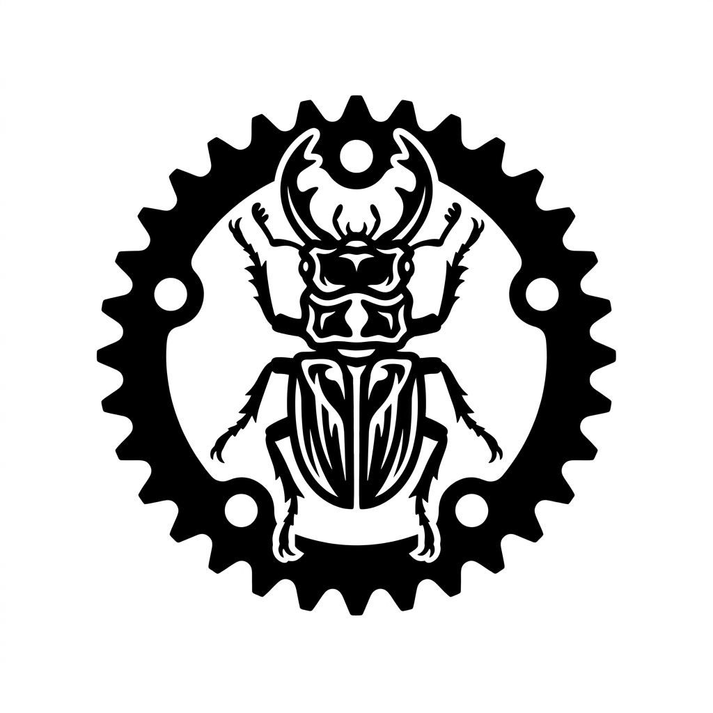
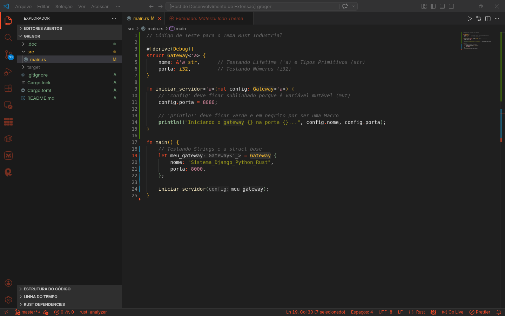
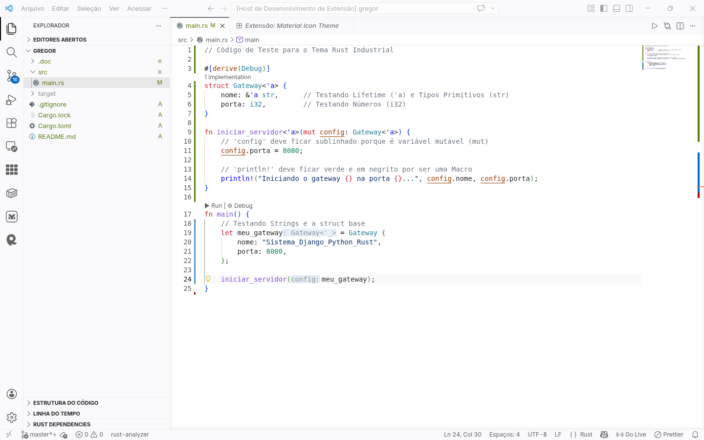

<div align="center">
    
</div>

# Rust Industrial Theme para VS Code

[](https://marketplace.visualstudio.com/)
[](https://marketplace.visualstudio.com/)
[](LICENSE)

Uma paleta de cores projetada meticulosamente para desenvolvedores Rust. Inspirado na estética industrial, nas cores oficiais da linguagem e desenhado para reduzir a fadiga visual em longas sessões de codificação de backend.

O tema **Rust Industrial** não apenas muda as cores do seu editor, mas entende a semântica do seu código, destacando _lifetimes_, _macros_ e _mutabilidade_ de forma inteligente.

---

## Screenshots

|                     Dark Mode                      |                      Light Mode                      |
| :------------------------------------------------: | :--------------------------------------------------: |
|  |  |

---

## Principais Funcionalidades

- **Suporte a Dark e Light Mode:** Alternância perfeita caso você use o recurso de _Auto Detect Color Scheme_ do sistema operacional.
- **Realce Semântico Profundo:** Construído para brilhar com o `rust-analyzer`.
  - **Variáveis Mutáveis:** Sublinhadas em laranja (ferrugem) instantaneamente para que você nunca perca o controle do estado (`let mut x`).
  - **Lifetimes (`'a`):** Destacados em itálico e com cor metálica contrastante.
  - **Macros (`println!`):** Estilizadas em negrito para se diferenciarem de funções comuns.
- **Suporte Otimizado para TOML:** Cores customizadas para o seu `Cargo.toml` (Recomendado usar com a extensão _Even Better TOML_).
- **Terminal Integrado Customizado:** A saída do `cargo run` e `cargo check` respeita a paleta do tema.

---

## Instalação

### Via Marketplace (Recomendado)

1. Abra o VS Code.
2. Vá para a aba de Extensões (`Ctrl+Shift+X` ou `Cmd+Shift+X`).
3. Pesquise por **Rust Industrial Theme**.
4. Clique em Instalar.
5. Pressione `Ctrl+K` seguido de `Ctrl+T` e selecione **Rust Industrial Dark** ou **Light**.

### Instalação Manual (.vsix)

Se você baixou o arquivo `.vsix` diretamente:

1. Vá na aba de Extensões.
2. Clique nos três pontinhos `...` no canto superior direito.
3. Selecione **"Install from VSIX..."** e escolha o arquivo baixado.

---

## Configurações Recomendadas

Para extrair **100% do poder deste tema** (especialmente o sublinhado de variáveis mutáveis e o destaque de _lifetimes_), você **precisa** ter a extensão oficial `rust-analyzer` instalada e o realce semântico ativado.

Adicione o seguinte trecho ao seu `settings.json` de usuário:

```json
{
  // Ativa a leitura inteligente de código do VS Code
  "editor.semanticHighlighting.enabled": true,

  // (Opcional) Usa a fonte oficial com ligaduras
  "editor.fontFamily": "'Fira Code', 'Cascadia Code', Consolas, monospace",
  "editor.fontLigatures": true
}
```
